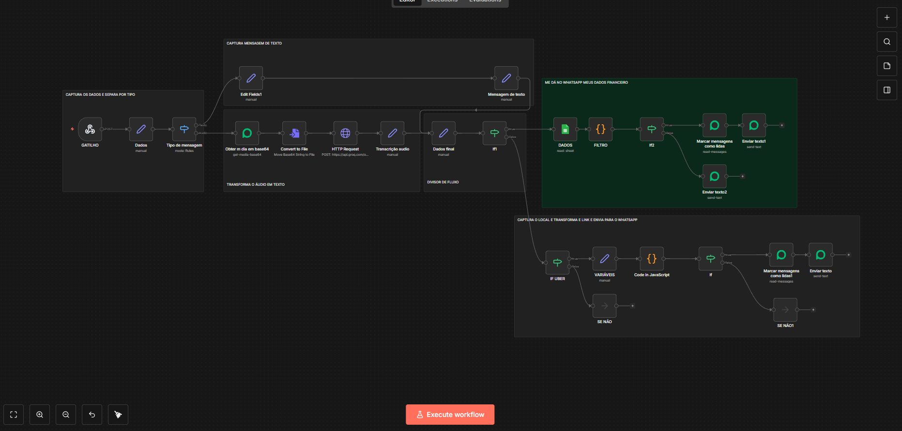

## ESSA IDEIA FOI PARA RESOLVER UM PROBLEMA DE UM CLIENTE
A mãe dela sai muito e sempre precisava que a filha ficasse pedindo Uber para ela. Ela não sabe ler nem escrever direito, mas mexe muito no WhatsApp mandando áudios. Como ela já usa muito o WhatsApp, nesse fluxo aqui funciona assim:

Ela manda um áudio que é capturado pelo webhook, que segue um fluxo que faz a transcrição para texto, que vai para outro bloco que separa as informações principais, como: número da pessoa que pediu, nome e o que ela pediu em texto (mensagem).

Isso passa para outro bloco que vai acoplar essas informações a um código JS simples, que vai transformar a mensagem em um link, ou para o Uber ou (caso ela queira ir para algum lugar perto) um link no Google Maps que dá a rota para ela.

Aí, com o número e o nome, ele envia tudo pronto para o WhatsApp do solicitante. Ele clica no link e abre já no app do Uber com o endereço de onde ele está e para onde ela quer ir.

Só precisa apenas clicar no botão de escolha do carro e depois confirmar a localização.

Isso resolveu o problema. Quando ela pede o Uber, é em uma conversa com a filha; chega o link e a filha fica sabendo para onde ela está indo.

Obs.: É necessário o GPS estar ligado sempre para facilitar, e ensinar a clicar em algumas etapas do Uber. Nem tudo pode ser automatizado 100%, tem coisas que precisam ainda de intervenção humana!

## 📸 Imagem do workflow no N8n
**O bloco em verde é outra automação que eu uso aqui com o mesmo webhook**
<p align="left">
  
</p>


### 🤖 Código JS do node CODE
```js
// 1. Captura os dados do nó anterior (seguindo seu mapeamento do print)
const localDesejado = ($json.messageConversation || "").trim();
const remoteJid = $json.remoteJid;
const pushName = $json.pushName || "Usuário";
const instance = $json.instance; // Capturando a instância
const messageId = $json.selectedId; // Capturando o ID da mensagem (keyId)
const REGIAO = "Pernambuco, BR"; 

if (!localDesejado) {
  return [{ 
    mensagem: "❌ Por favor, diga o lugar ou endereço.", 
    remoteJid: remoteJid,
    instance: instance,
    messageId: messageId
  }];
}

// 2. Preparação do endereço
const buscaCompleta = `${localDesejado}, ${REGIAO}`;
const enderecoLimpo = encodeURIComponent(buscaCompleta);
const cacheBuster = Math.floor(Math.random() * 1000000);

// 3. Link UBER e Google Maps
const linkUber = `https://m.uber.com/ul/?action=setPickup&pickup=my_location&dropoff[formatted_address]=${enderecoLimpo}&ref=${cacheBuster}`;
const linkMaps = `https://www.google.com/maps/dir/?api=1&destination=${enderecoLimpo}&travelmode=driving`;

// 4. Montagem da Mensagem
const mensagemFinal = `🚗 *Opções de Corrida para ${pushName}* 🚗

📍 *Destino:* ${localDesejado}

⚫ *ABERTO NO UBER:*
🔗 ${linkUber}

🟡 *ROTA NO MAPS:*
🔗 ${linkMaps}

_Dica: No Google Maps, clique no ícone de "bonequinho acenando" para ver o 99 caso necessário._`;

// 5. Retorno com todos os dados necessários para o próximo nó
return [{
  mensagem: mensagemFinal,
  remoteJid: remoteJid,
  instance: instance,
  messageId: messageId,
  pushName: pushName
}];
```
